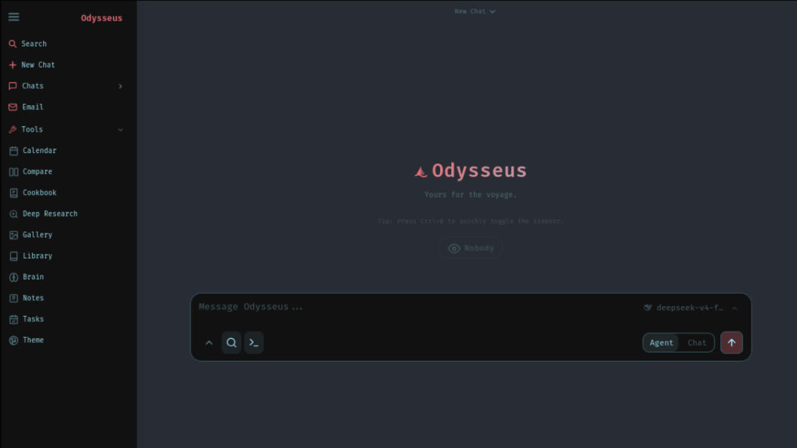

# Apollo

```
───────────────────────────────────────────────
 ⊹ ࣪ ˖ ૮( ˶ᵔ ᵕ ᵔ˶ )っ  Apollo vers. 1.0
───────────────────────────────────────────────
```



**Apollo is a self-hosted, local-first AI workspace** — the ChatGPT/Claude UI experience
running entirely on your own hardware, with your own data and your own models. But with
more jank and fun. Privacy-first, no telemetry, no trojan.

**What it actually does**, concretely:

- **Chats with language models** — local GGUF files that Apollo discovers in folders you
  configure and serves on demand through `llama.cpp` (one warm model at a time, swapped
  automatically when you pick another), or any OpenAI-compatible / Anthropic / OpenRouter /
  Groq / Ollama endpoint you add. Streaming SSE responses, presets, sessions, folders,
  multimodal attachments.
- **Runs autonomous agents** — an agent mode with shell/web/file/MCP tools, a PRD-driven
  "Ralph" iteration loop, and a bundled **[Paperclip](https://github.com/paperclipai/paperclip)**
  agent-management sidecar whose agents run on your local models through a token-guarded
  proxy (`/lmproxy/v1`). Their activity renders live as an **isometric Lego office**
  ("The Floor"): each agent gets a desk, walks to a review table or help bar as its state
  changes, speaks task-based speech bubbles, and walks out an exit door when its work is done.
- **Researches** — multi-step deep-research runs that search (SearXNG/DDG/Brave/Tavily…),
  crawl pages into clean Markdown (crawl4ai), and synthesize cited visual reports.
- **Remembers** — persistent semantic memory and skills (ChromaDB + local fastembed ONNX
  embeddings) that the assistant consults and updates across sessions.
- **Manages your day** — IMAP/SMTP email with AI triage (urgency, auto-tag, summaries,
  reply drafts, spam), notes with reminders, cron-scheduled tasks, and a CalDAV-synced
  calendar — all agent-accessible.
- **Edits documents** — a multi-tab editor (Markdown/HTML/CSV, syntax highlighting) where
  AI assists rather than replaces; plus image gallery, file uploads with vision/PDF
  understanding, model comparison with blind testing, and a hardware-aware model
  "Cookbook" (scan → recommend → download → serve).
- **Looks how you want** — 24 built-in themes (dark *and* light), a full theme editor with
  custom palettes, background effects, fonts and density; responsive/installable PWA.

It is a three-tier system: a **FastAPI backend** (Python 3.11+) exposing ~40 modular
routers, a **framework-free vanilla-JS frontend** (ES modules, server-sent events, no
build step), and a **SQLite + ChromaDB data layer**. Everything runs as one `uvicorn`
process plus on-demand `llama-server` subprocesses and the optional Paperclip Node
sidecar. See [Architecture](#architecture) below for enough detail to rebuild it.

> Apollo is a renamed distribution of **[Odysseus](https://github.com/pewdiepie-archdaemon/odysseus)** by **pewdiepie-archdaemon**. All the original work is theirs — Apollo only changes the name. See [ACKNOWLEDGMENTS.md](ACKNOWLEDGMENTS.md) for full credits.

## Features
  - **Chat** -- chat with any local model or API; adding them is super simple.<br>　<sub>vLLM · llama.cpp · Ollama · OpenRouter · OpenAI</sub>
  - **Local Models** -- point Apollo at folders of GGUF models; they're discovered automatically, appear in the model picker, and a llama.cpp server is launched on the fly when you pick one.<br>　<sub>folder auto-scan · auto-serve on select · single warm chat model · configurable dirs (Settings → AI)</sub>
  - **Agent** -- hand it tools and let it run the whole task itself.<br>　<sub>built on [opencode](https://github.com/anomalyco/opencode) · MCP · web · files · shell · skills · memory</sub>
  - **Ralph Loop** -- an opt-in PRD/task loop for learning across iterations and getting scoped agent work done.<br>　<sub>prd.json · progress.md · AGENTS learning snippets · quality gates</sub>
  - **Browser + Crawl Agents** -- browser-use verifies real UI workflows, while crawl4ai turns web sources into research-ready Markdown.<br>　<sub>Paperclip Floor QA · Ralph verification commands · Crawl4AI source imports</sub>
  - **Cookbook** -- Scans your hardware, recommends models, click to download and serve.. easy!<br>　<sub>built on [llmfit](https://github.com/AlexsJones/llmfit) · VRAM-aware · GGUF / FP8 / AWQ · fit scoring · vLLM / llama.cpp serving</sub>
  - **Deep Research** -- multi-step runs that gather, read, and synthesize sources into a nice visual report.<br>　<sub>adapted from [Tongyi DeepResearch](https://github.com/Alibaba-NLP/DeepResearch)</sub>
  - **Compare** -- a fun tool to compare models side by side. Test completely blind, no bias!<br>　<sub>multi-model · blind test · synthesis</sub>
  - **Documents** -- YOU write the text, AI is there to assist, not the opposite.<br>　<sub>multi-tab editor · markdown · HTML · CSV · syntax highlighting · AI edits · suggestions</sub>
  - **Memory / Skills** -- Persistent memory and skills, your agent evolves over time as it better understands you and your tasks!<br>　<sub>ChromaDB · fastembed (ONNX) · vector + keyword retrieval · import/export</sub>
  - **Email** -- IMAP/SMTP inbox with AI triage built in: urgency reminders, auto-tag, auto-summary, auto-reply drafts, auto-spam.<br>　<sub>IMAP · SMTP · per-account routing · CalDAV-aware</sub>
  - **Notes & Tasks** -- Quick notes with reminders, a todo list, and scheduled tasks the agent can act on.<br>　<sub>note pings · checklist · cron-style tasks · ntfy / browser / email channels</sub>
  - **Calendar** -- Local-first calendar with CalDAV sync to Radicale / Nextcloud / Apple / Fastmail.<br>　<sub>CalDAV pull · .ics import/export · per-calendar colors · agent-aware</sub>
  - **Works on mobile** -- looks and runs great on your phone, not just desktop.<br>　<sub>responsive · installable (PWA) · touch gestures</sub>
  - **Extras** -- more to explore, happy if you give it a go!<br>　<sub>image editor · theme editor · file uploads (vision + PDF) · web search · presets · sessions · 2FA</sub>

## Demo
A full, hover-to-play tour lives on the landing page (`docs/index.html`).

<details>
<summary>Screenshots / clips</summary>

### Chat & Agents

### Deep Research

### Compare

### Documents

### Notes & Tasks


</details>

## Quick Start

Defaults work out of the box: clone, run, then configure models/search/email
inside **Settings**. Only edit `.env` for deployment-level overrides like
`APP_BIND`, `APP_PORT`, `AUTH_ENABLED`, `DATABASE_URL`, or a pre-seeded admin password.

On first setup, Apollo creates an admin account (`admin` unless
`APOLLO_ADMIN_USER` is set) and prints a temporary password in the terminal.
For Docker installs, the same line is in `docker compose logs apollo`.
Use that for the first login, then change it in **Settings**.

Contributing? See [CONTRIBUTING.md](CONTRIBUTING.md) for setup, testing, and
pull request guidelines.

### Docker (recommended)
```bash
git clone https://github.com/Antman1526/Apollo.git
cd Apollo
cp .env.example .env       # optional, but recommended for explicit defaults
docker compose up -d --build
```
Open `http://localhost:7000` when the containers are healthy. Docker Compose
binds the web UI to `127.0.0.1` by default. If the port is taken, set
`APP_PORT=7001` in `.env` and recreate the container. Set `APP_BIND=0.0.0.0`
only when you intentionally want LAN/reverse-proxy access.

#### Paperclip (agent management) — optional

Apollo can bundle **[Paperclip](https://github.com/paperclipai/paperclip)**, an
agent-management UI, as an opt-in sidecar. In Docker it runs as its own
container (plus a small Postgres) behind a `paperclip` Compose profile; in
native desktop mode Apollo supervises the `paperclipai` process directly. Its
agents run on your **local model** (default: Ollama or Apollo's local-model
proxy).

Enable it:

```bash
# in .env
PAPERCLIP_ENABLED=true
PAPERCLIP_AUTH_SECRET=$(openssl rand -hex 32)   # paste the generated value
# optional: PAPERCLIP_MODEL_BASE_URL / PAPERCLIP_MODEL_ENDPOINT (defaults to host Ollama)

docker compose --profile paperclip up -d --build
```

On first open, Paperclip shows a one-time **claim** screen to create its admin
account. Then add an agent with the **`opencode-local`** adapter and a model id
like `openai/<your-ollama-model>` to run work on your local model. A normal
`docker compose up` (without the profile) is unaffected — the sidecar never
starts and no secret is required.

> **Native desktop (no Docker):** in the macOS `.app`/`.dmg` and the Windows
> launcher, Paperclip runs in **native mode** — Apollo supervises the
> `paperclipai` process itself (it self-manages an embedded Postgres) and
> **auto-downloads a pinned Node runtime** into `~/.apollo/.node` on first use,
> so there's nothing to install. Enable with `PAPERCLIP_ENABLED=true`; agents are
> pointed at Apollo's local-model proxy (`/lmproxy/v1`), which serves whichever
> GGUF you have running from your local-models folder.

Open it from the **Paperclip** sidebar tab. Apollo shows three views:

- **Floor** — the Apollo-native animated workspace: an isometric office where
  agents appear as Lego-like minifigs with their own desks, walking between
  stations, sitting down to work, and holding task-based conversations. See
  [docs/paperclip-floor.md](docs/paperclip-floor.md) for a tour and the event
  ingest API.
- **Board** — the same agent state as a Kanban-style work board.
- **Classic** — Paperclip's own UI loaded from `PAPERCLIP_BROWSER_URL`.

The Floor renders live data from Apollo's `/api/paperclip/stream` SSE endpoint
(fed by `POST /api/paperclip/events`). While no events have been ingested it
plays a demo preview and keeps the stream open in a waiting state, switching
to live automatically when agent activity starts; when the sidecar is disabled
it falls back to the preview entirely.

#### Apollo Ralph loop (optional)

Apollo includes an opt-in Ralph-style loop inspired by
[Ralph for Claude Code](https://github.com/frankbria/ralph-claude-code) and
[snarktank/ralph](https://github.com/snarktank/ralph). It does not run unless
you invoke it, and it keeps its workspace state under `.apollo/ralph/`.

```bash
scripts/apollo-ralph init
scripts/apollo-ralph status
scripts/apollo-ralph next --prompt
scripts/apollo-ralph check
scripts/apollo-ralph record story-1 --passes --learning "What changed"
```

Use the shared workbench status when you want one readiness view for Paperclip,
the embedded browser, browser-use, crawl4ai, and Ralph:

```bash
scripts/apollo-integrations agent-workbench --pretty
```

#### Embedded browser panel and agent tool

Apollo is a FastAPI/static-web app, not an Electron shell, so the IDE browser is
implemented as a sandboxed in-app panel plus a shared Playwright Chromium
session for agents. Open the panel from **Browser** in the sidebar or icon rail.
It includes back, forward, reload, an address bar, Go, external-open, and a
console rail fed by the agent browser session.

Agent mode exposes a native `browser` tool:

```json
{"action":"navigate","url":"http://localhost:3000"}
{"action":"getVisibleText"}
{"action":"waitForSelector","selector":"#app"}
{"action":"click","selector":"button[type=submit]"}
{"action":"type","selector":"input[name=q]","text":"Apollo"}
{"action":"screenshot","full_page":true}
```

The same contract is available over HTTP under `/api/browser/*`, including
`/navigate`, `/current`, `/html`, `/text`, `/execute`, `/screenshot`, `/wait`,
`/click`, `/type`, `/events`, and `/detect-localhost`. Only `http://` and
`https://` navigation is allowed; `file://`, `javascript:`, `data:`, Chromium
internal URLs, and Node/Electron-style schemes are blocked.

Install the optional runtime when agent browser control is needed:

```bash
pip install playwright
python -m playwright install chromium
```

The loop uses `prd.json` for user stories, dependencies, priorities, and pass
state; `progress.md` for append-only learning; `AGENTS.learning.md` for durable
project notes; and `state.json`/`logs/` for iteration history. `run-once`
prints the next agent prompt by default, or can feed it to an agent command and
then run `./scripts/check.sh` as the quality gate:

```bash
scripts/apollo-ralph run-once --agent-cmd "claude --print" --auto-mark
```

The prompt contract requires the agent to emit `EXIT_SIGNAL: true` only when
the selected story is complete and checks pass. `--auto-mark` requires both the
configured quality check and that explicit exit signal, keeping the loop focused
on one verified task at a time. Use `--timeout-minutes` to cap a single agent
iteration.

Stories can also require an extra verification command:

```json
{
  "id": "paperclip-floor-browser-qa",
  "title": "Verify Paperclip Floor in a real browser",
  "verificationCommand": "scripts/check-paperclip-browser --base-url http://127.0.0.1:7000"
}
```

`--auto-mark` requires that command to pass too.

#### browser-use and crawl4ai

Apollo includes mandatory integration points for
[browser-use](https://github.com/browser-use/browser-use) and
[crawl4ai](https://github.com/unclecode/crawl4AI).

Install crawl4ai with Apollo's main dependencies, then install browser-use into
its isolated browser-agent environment:

```bash
pip install -r requirements.txt
scripts/setup-browser-use-env
```

Use browser-use to verify Paperclip's animated Floor from a real browser agent:

```bash
scripts/check-paperclip-browser --status
scripts/check-paperclip-browser --base-url http://127.0.0.1:7000
```

By default the browser agent uses Apollo's local OpenAI-compatible proxy, so a
`BROWSER_USE_API_KEY` is not required for local model checks. The verifier sends
local requests to `<base-url>/lmproxy/v1`, uses Apollo's Paperclip proxy token,
and reads the model from `APOLLO_BROWSER_USE_MODEL`, `PAPERCLIP_MODEL_NAME`, or
`APOLLO_LOCAL_MODEL_ID`. You can also pass the model directly:

```bash
scripts/check-paperclip-browser \
  --base-url http://127.0.0.1:7000 \
  --model llama3
```

For a custom OpenAI-compatible local endpoint, use:

```bash
scripts/check-paperclip-browser \
  --base-url http://127.0.0.1:7000 \
  --model qwen-local \
  --model-base-url http://127.0.0.1:11434/v1 \
  --model-api-key local-token
```

If you intentionally want Browser Use's hosted model instead, set
`APOLLO_BROWSER_USE_LLM_PROVIDER=browser-use` and `BROWSER_USE_API_KEY`, or pass
`--llm-provider browser-use`.

Use crawl4ai to import a web source into the research library as clean Markdown:

```bash
scripts/apollo-research crawl https://example.com --owner <apollo-user>
```

The API equivalents are:

- `GET /api/paperclip/status` includes `browser_use` readiness.
- `GET /api/integrations/agent-workbench/status` reports Paperclip, embedded browser, browser-use, crawl4ai, and Ralph readiness together.
- `GET /api/research/crawl4ai/status` reports crawl4ai readiness.
- `POST /api/research/crawl4ai/crawl` crawls and optionally saves a source import.

For safety, crawl4ai URL imports block private, loopback, link-local, reserved,
and non-HTTP(S) targets by default. Set `APOLLO_CRAWL4AI_ALLOW_PRIVATE=true`
only for trusted local development.

### Native Linux / macOS
```bash
git clone https://github.com/Antman1526/Apollo.git
cd Apollo
python3 -m venv venv
source venv/bin/activate
pip install -r requirements.txt
python setup.py
python -m uvicorn app:app --host 127.0.0.1 --port 7000
```
Requirements: Python 3.11+. Cookbook also needs `tmux` for background model
downloads and serves. The app itself is lightweight; local model serving is the
heavy part and depends on the model, runtime, GPU, and VRAM, so small hosts can
connect to API or remote model servers instead. Use `--host 0.0.0.0` only when you intentionally want LAN/reverse-proxy access.

### Apple Silicon
Docker on macOS cannot use the Metal GPU. For GPU-accelerated Cookbook on an
M-series Mac, run Apollo natively:

```bash
git clone https://github.com/Antman1526/Apollo.git
cd Apollo
./start-macos.sh
```

It launches at `http://127.0.0.1:7860`. To expose it to your phone over a trusted LAN/VPN such as Tailscale, bind all interfaces:

```bash
APOLLO_HOST=0.0.0.0 ./start-macos.sh
# then open http://<tailscale-ip>:7860
```

The script also reads `.env` at startup, so `APP_BIND=0.0.0.0` and `APP_PORT`
set there are picked up automatically without a command-line override each run.

Keep `AUTH_ENABLED=true` (the default) before binding outside loopback. Do not
expose this port directly to the public internet.

**Clickable app + `.dmg`.** After `start-macos.sh` has set up the environment,
build a double-clickable macOS app and a drag-to-Applications disk image:

```bash
./build-macos-app.sh
# produces:
#   dist/Apollo.app   — double-click to start the server and open the UI
#   dist/Apollo.dmg   — open it, then drag Apollo to /Applications
```

This is a native launcher: it drives the repo's `venv/` (Python isn't bundled),
so Cookbook keeps direct Metal-GPU access. Rebuild after moving the repo, since
the install path is baked into the app.

<details>
<summary>Cookbook, GPU, Ollama, and troubleshooting notes</summary>

**Docker bundled services.** Compose starts Apollo, ChromaDB, SearXNG, and
ntfy. Apollo and the bundled service ports bind to `127.0.0.1` by default, so
they are reachable from the host but not exposed to your LAN/public internet
unless you opt in.

**Cookbook storage in Docker.** Downloads live in `./data/huggingface`
(`~/.cache/huggingface` in the container). Cookbook-installed Python CLIs and
serve engines live in `./data/local` (`~/.local` in the container), so they
survive container recreation.

**Remote servers.** In **Cookbook -> Settings -> Servers**, generate the
Apollo SSH key and add the public key to the remote server's
`~/.ssh/authorized_keys`. From the host you can also run:

```bash
ssh-copy-id -i data/ssh/id_ed25519.pub user@server
```

**Docker GPU overlays.** CPU-only users can skip this section. Cookbook can
only detect GPUs that Docker exposes to the container — if the host runtime or
device passthrough is not configured, Cookbook sees the iGPU, another card, or
CPU instead of your intended GPU.

For NVIDIA, `scripts/check-docker-gpu.sh` diagnoses GPU passthrough and can
optionally install the host runtime or update `.env`.

```bash
# Read-only diagnostic (default — installs nothing, never edits .env):
scripts/check-docker-gpu.sh

# Print OS-specific install commands without running them:
scripts/check-docker-gpu.sh --print-install-commands

# Install NVIDIA Container Toolkit on Ubuntu/Debian (requires sudo):
scripts/check-docker-gpu.sh --install-nvidia-toolkit

# Write COMPOSE_FILE to .env (only when GPU passthrough is confirmed working):
scripts/check-docker-gpu.sh --enable-nvidia-overlay

# Full assisted setup — install toolkit, then enable overlay if passthrough works:
scripts/check-docker-gpu.sh --install-nvidia-toolkit --enable-nvidia-overlay
```

Safety notes:
- The app never installs host GPU runtime automatically.
- The app never edits `.env` automatically.
- `.env` is only modified when `--enable-nvidia-overlay` is explicitly passed,
  and only after GPU passthrough succeeds. `--yes` skips prompts but does not
  bypass the passthrough gate.
- `.env.bak.*` backups created by `--enable-nvidia-overlay` are ignored by
  Git and the Docker build context.

To enable manually without the script, add this to `.env`:

```bash
COMPOSE_FILE=docker-compose.yml:docker/gpu.nvidia.yml
```

**AMD / ROCm.** AMD setup is read-only diagnostic plus manual `.env` edit. Run:

```bash
scripts/check-docker-amd-gpu.sh
```

Then add the reported values to `.env`, replacing `RENDER_GID` with your host's
numeric render group id:

```bash
COMPOSE_FILE=docker-compose.yml:docker/gpu.amd.yml
RENDER_GID=989
```

For NVIDIA/AMD GPU support, also read the comments in the selected overlay file: docker/gpu.nvidia.yml or docker/gpu.amd.yml.

Verify after enabling either overlay:

```bash
docker compose exec apollo nvidia-smi -L   # NVIDIA
docker compose exec apollo sh -lc 'test -e /dev/kfd && test -d /dev/dri && ls -l /dev/kfd /dev/dri/renderD*'  # AMD
```

> **GPU passthrough ≠ llama.cpp CUDA.** `nvidia-smi` passing inside the
> container confirms Docker GPU access, but llama.cpp also needs `cudart` and
> the CUDA Toolkit at runtime. If Cookbook logs show `Unable to find cudart
> library`, `Could NOT find CUDAToolkit`, `CUDA Toolkit not found`, or
> tensors/layers assigned to CPU, that is a Cookbook/llama.cpp build issue —
> not a Docker passthrough failure. Re-install the serve engine via
> **Cookbook → Dependencies** to get a CUDA-enabled build.
>
> The same split applies to AMD/ROCm: seeing `/dev/kfd` and `/dev/dri` inside
> the container confirms device passthrough, not ROCm userspace or a
> ROCm-enabled vLLM/llama.cpp build. `rocm-smi` and `rocminfo` are not expected
> inside the slim Apollo image.

**Ollama with Docker.** If Ollama runs on the host, add this endpoint in
Settings:

```text
http://host.docker.internal:11434/v1
```

Ollama must listen outside its own loopback interface:

```bash
OLLAMA_HOST=0.0.0.0:11434 ollama serve
```

This connects Apollo in Docker to an Ollama server that is already running on
your host machine; it does not start Ollama inside the container.
`host.docker.internal` is Docker's hostname for the host machine from inside the
container. Cookbook **Serve** is a separate workflow for serving downloaded
models through Apollo/llama.cpp, so Windows users with an existing Ollama
install usually only need to add the endpoint in Settings.

**Useful checks.**

```bash
docker compose ps
docker compose logs --tail=120 apollo
docker compose logs apollo | grep -E 'ChromaDB|MemoryVectorStore|DEGRADED'
```

**macOS details.** `start-macos.sh` installs Homebrew deps, creates the venv,
runs setup, and starts uvicorn on port `7860` because AirPlay often holds
`7000`. It uses llama.cpp/Ollama for Metal. vLLM/SGLang are CUDA/ROCm-only and
do not run on macOS. MLX-only models are not served by Apollo.

</details>

### Native Windows

**One-command launcher** (creates the venv, installs deps, runs setup, starts the
server; safe to re-run):

```powershell
git clone https://github.com/Antman1526/Apollo.git
cd Apollo
powershell -ExecutionPolicy Bypass -File .\launch-windows.ps1
```

Or do it by hand:

```powershell
git clone https://github.com/Antman1526/Apollo.git
cd Apollo
py -3.11 -m venv venv
venv\Scripts\Activate.ps1
pip install -r requirements.txt
python setup.py
python -m uvicorn app:app --host 127.0.0.1 --port 7000
```

If `python` points at an older interpreter, use `py -3.12` (or another installed
3.11+ version) for the venv step.

**Requirements:** Python 3.11+. The core app (chat, agent, memory, documents,
email, calendar, deep research) runs fully native. For full **Cookbook** background
model downloads and the agent shell tool, also install
[Git for Windows](https://git-scm.com/download/win) (provides `bash.exe`).
Local GPU *serving* of vLLM/SGLang needs Linux/WSL2; for a local model on Windows,
[Ollama](https://ollama.com/download) is the easiest path — point Apollo at
`http://localhost:11434/v1` in Settings.

Open `http://localhost:7000`, log in with the generated admin password,
and configure everything else inside **Settings**.

## Security Notes
Apollo is a self-hosted workspace with powerful local tools: shell access, file uploads, model downloads, web research, email/calendar integrations, and API tokens. Treat it like an admin console.

- Keep `AUTH_ENABLED=true` for any network-accessible deployment.
- Keep `LOCALHOST_BYPASS=false` outside local development.
- Use `SECURE_COOKIES=true` when Apollo is served through HTTPS by a trusted reverse proxy or private access gateway.
- Do not expose it directly to the public internet without HTTPS and a trusted reverse proxy or private access layer.
- Keep `.env`, `data/`, `logs/`, databases, uploads, generated media, backups, auth/session files, API keys, and model/provider tokens out of Git and private shares. They are ignored by default.
- Review `data/auth.json` after first boot: disable open signup unless you intentionally want it, make only your own account admin, and keep demo/test accounts non-admin.
- Non-admin users do not get shell/Python/file read/write by default, and admin-only routes/tools such as MCP management, API tokens, webhooks, model/cookbook serving, backup/vault, and app settings are admin-gated. Other features are controlled by per-user privileges, so review each user's privileges before exposing a deployment.
- Rotate any API keys or tokens that were ever pasted into a shared chat, demo, screenshot, or log.
- If you enable API tokens or webhooks, create separate tokens per integration and delete unused ones.
- Prefer binding manual development runs to `127.0.0.1`; bind to `0.0.0.0` only when you intentionally want LAN/reverse-proxy access.
- Keep ChromaDB, SearXNG, ntfy, Ollama, vLLM, llama.cpp, databases, and raw model/provider APIs internal-only. Expose only the authenticated Apollo web/API entrypoint through your trusted proxy or private access layer.
- Before publishing a fork, run `git status --short` and confirm no private files from `.env`, `data/`, `logs/`, uploads, backups, or local databases are staged.

For runtime health checks, startup diagnostics, log cleanup, and recovery order,
see [`docs/OPERATIONS.md`](docs/OPERATIONS.md).

### Private or proxied deployments
Apollo serves plain HTTP on its app port. Docker Compose binds Apollo and the bundled services to `127.0.0.1` by default, so a typical production/private setup is:

1. Keep Apollo on localhost, for example `127.0.0.1:7000`.
2. Terminate HTTPS at a trusted reverse proxy or private access gateway.
3. Put the authenticated Apollo web/API entrypoint behind that layer.
4. Keep raw service and model ports internal-only.

Cloudflare Access, Tailscale, Caddy, nginx, and Traefik can all fit this pattern; none are required by Apollo. If your access layer reaches Apollo on the same host, proxy to `http://127.0.0.1:7000` and keep `AUTH_ENABLED=true`, `LOCALHOST_BYPASS=false`, and `SECURE_COOKIES=true`.

Common internal-only ports from the default docs/compose setup:

| Port | Service |
|---|---|
| `7000` | Apollo raw app port |
| `8080` | SearXNG |
| `8091` | ntfy |
| `8100` | ChromaDB host port for manual/compose access |
| `11434` | Ollama |
| `8000-8020` | Common local model/provider APIs |

## Contributing
Help is welcome. The best entry points are fresh-install testing, provider setup
bugs, mobile/editor polish, docs, and small focused refactors. See
[ROADMAP.md](ROADMAP.md) for the current help-wanted list.

## Configuration
Most setup is done inside the app with `/setup` or **Settings**. Use `.env`
for deployment-level defaults and secrets you want present before first boot.
Key settings:

| Variable | Default | Description |
|---|---|---|
| `LLM_HOST` | `localhost` | Your LLM server (e.g. `llm-host.local:8000`) |
| `LLM_HOSTS` | -- | Comma-separated list for model discovery |
| `OPENAI_API_KEY` | -- | Optional OpenAI key. Prefer adding providers in the app unless pre-seeding. |
| `SEARXNG_INSTANCE` | `http://localhost:8080` | SearXNG URL. Docker overrides this to `http://searxng:8080`. |
| `SEARXNG_SECRET` | generated on first Docker boot | Optional SearXNG cookie/CSRF secret. Leave blank unless you need to pin it. |
| `APP_BIND` | `127.0.0.1` | Docker Compose host bind address for the web UI. Use `0.0.0.0` only for intentional LAN/reverse-proxy access. |
| `APP_PORT` | `7000` | Docker Compose host port for the web UI. |
| `AUTH_ENABLED` | `true` | Enable/disable login |
| `LOCALHOST_BYPASS` | `false` | Development-only auth bypass for loopback requests. Keep false for shared/network deployments. |
| `SECURE_COOKIES` | `false` | Set true when serving Apollo through HTTPS at a trusted proxy or private access gateway. |
| `DATABASE_URL` | `sqlite:///./data/app.db` | Database connection string |
| `CHROMADB_HOST` | `localhost` | ChromaDB host for vector memory. Docker overrides this to `chromadb`. |
| `CHROMADB_PORT` | `8100` | ChromaDB port for manual host runs. Docker overrides this to `8000`. |
| `EMBEDDING_URL` | -- | OpenAI-compatible embeddings endpoint |

### Built-in MCP servers (optional setup)

Apollo auto-registers a few built-in MCP servers at startup. The npx-based ones (currently the browser server, `@playwright/mcp`) only start when their npm package is already in the local npx cache. If a package isn't cached, that server is skipped with a startup log message explaining what to do, so a fresh install does not block on a multi-minute npm download or hang if Playwright system deps are missing.

To enable the browser MCP (page navigation, screenshots, vision), run once:

```bash
npx -y @playwright/mcp@latest --version
```

That installs `@playwright/mcp` plus Playwright (~300MB total). Restart Apollo and the server will register at startup.

## Architecture

Enough detail here to rebuild the system from scratch; the patterns below are the
load-bearing ones.

```
app.py                   # FastAPI entry point: middleware, ~40 router registrations,
                         # startup/shutdown hooks (model scan, Paperclip runtime+collector)
core/      auth manager, SQLAlchemy models + engine (database.py), middleware
           (require_admin, internal-tool token), session manager, constants
src/       llm_core (provider calls + SSE streaming), agent_loop/agent_tools/agent_runs,
           mcp_manager, event_bus, model_context, request_models, endpoint_resolver
routes/    one module per feature: <name>_routes.py exposes
           setup_<name>_routes(deps...) -> APIRouter; never imports other routes
services/  domain logic: localmodels/ (GGUF scanner, single-warm-slot llama-server
           manager, picker registry), paperclip/ (config, native runtime supervisor,
           Node bootstrap w/ checksum verify, reverse-proxy helpers, EventHub,
           live-events collector, per-agent token registry), memory/, integrations/ …
static/    index.html (single page: sidebar + rail + modals) + style.css (CSS-variable
           theming, color-mix tokens) + js/ ES modules (app.js orchestrator; theme.js
           preset/custom themes; paperclip.js floor engine+renderer; storage.js …)
tests/     flat pytest suite (~1,580 tests) + node:test .mjs suites; scripts/check.sh
           = compileall + pytest + npm test is the single quality gate
docs/      landing page, preview clips, Paperclip Floor guide (paperclip-floor.md),
           engineering handoff (superpowers/PAPERCLIP-HANDOFF.md)
```

**Key patterns (the parts you'd need to get right when recreating it):**

- **Router factories with labeled registration.** Every feature is
  `setup_<name>_routes(...) -> APIRouter`, registered in `app.py` through
  `build_and_include_router(app, "Label", factory, *deps)` so a broken feature fails
  loudly at startup with its label. Dependencies (managers, config, the shared event
  hub) are passed in — routes never construct globals.
- **One auth middleware, explicit exemptions.** `AuthMiddleware` is installed only when
  `AUTH_ENABLED=true`; cookie sessions, optional TOTP 2FA, `ody_` bearer API tokens, and
  a loopback internal-tool token. Self-authenticating endpoints (`/lmproxy/*`, task
  webhooks, `/api/paperclip/events`) live in `AUTH_EXEMPT_PREFIXES` and prove identity
  themselves (token match or loopback-only). Websockets bypass HTTP middleware, so the
  Paperclip WS proxy validates the session cookie explicitly. With auth disabled
  (single-user mode), ownership checks short-circuit (`_auth_disabled()` pattern).
- **Local models: scan → catalog → single warm slot.** `services/localmodels/scanner.py`
  walks configured dirs for GGUFs (skipping AppleDouble `._` files, split parts, mmproj);
  the registry syncs a deduped name list into the picker's `cached_models`;
  `server_manager.ensure_running(model)` swaps one warm `llama-server` subprocess
  (context = `min(model's known window, APOLLO_LLAMA_CONTEXT=16384)`, health timeout
  scaled 40s/GB). Chat resolves the `local://llama.cpp` endpoint sentinel through
  `materialize_local_url()` at call time. First configured dir wins for duplicate names.
- **Streaming.** Chat and the Floor both use SSE: `data:` JSON frames, an `event: error`
  channel with status codes, `[DONE]` terminators. Client disconnects are handled with a
  guarded partial-save (a save failure must never mask the `CancelledError`).
- **The Paperclip pipeline.** One bounded `EventHub` (200-entry replay deque, seq
  watermark, drop-don't-backpressure subscriber queues) is fed by three producers —
  HTTP ingest, a reconnecting WebSocket collector against Paperclip's live-events
  endpoint, and per-agent lmproxy activity pulses — and drained by `/api/paperclip/stream`
  (emits `paperclip.stream.waiting` while idle instead of closing). The Floor UI keeps
  all layout in logical 0-100 coordinates and projects to an isometric SVG stage at
  render time; furniture and minifig agents share one depth-sorted paint list (true
  occlusion); movement animates exactly once per change via committed `lastX/lastY`;
  identical-HTML renders skip the DOM write so animations never restart.
- **Packaging is launcher-style.** `build-macos-app.sh` produces `Apollo.app`/`Apollo.dmg`
  that drive this repo's venv (install path baked at build time);
  `scripts/windows-launcher/apollo_launcher.c` cross-compiles (mingw-w64) to `Apollo.exe`,
  which opens `launch-windows.ps1` in a console beside it.

**Stack:** Python 3.11+ · FastAPI/Starlette/uvicorn · httpx (all outbound HTTP incl.
streaming proxies) · websockets · SQLAlchemy/SQLite · ChromaDB + fastembed · llama.cpp ·
vanilla ES-module JS · node:test + pytest. Full dependency rationale lives as comments
in `requirements.txt`.

## Data
All user data lives in `data/` (gitignored): `app.db` (SQLite: sessions, messages,
documents, model endpoints, MCP servers, notes, calendars, scheduled tasks, gallery,
memories, email accounts, API tokens, webhooks), `auth.json` (users/2FA),
`user_prefs.json` (per-user prefs incl. custom themes and local-model folders),
`memory.json`, `presets.json`, `uploads/`, `personal_docs/`, `chroma/` (vector memory).
Generated secrets live in `~/.apollo/` with 0600 permissions (Paperclip auth secret,
proxy token, per-agent tokens).

## Star History

<a href="https://www.star-history.com/?repos=Antman1526%2FApollo&type=date&legend=top-left">
 <picture>
   <source media="(prefers-color-scheme: dark)" srcset="https://api.star-history.com/chart?repos=Antman1526/Apollo&type=date&theme=dark&legend=top-left" />
   <source media="(prefers-color-scheme: light)" srcset="https://api.star-history.com/chart?repos=Antman1526/Apollo&type=date&legend=top-left" />
   
 </picture>
</a>

## License
MIT -- see [LICENSE](LICENSE) and [ACKNOWLEDGMENTS.md](ACKNOWLEDGMENTS.md).

```
                                  |
                                 |||
                                |||||
                  |    |    |   |||||||
                 )_)  )_)  )_)   ~|~
                )___))___))___)\  |
               )____)____)_____)\\|
             _____|____|____|_____\\\__
             \                       /
       ~^~^~~^~^~~^~^~~^~^~~^~^~~^~^~~^~^~~^~^~
               ~^~  all aboard!  ~^~
       ~^~^~~^~^~~^~^~~^~^~~^~^~~^~^~~^~^~~^~^~
```
