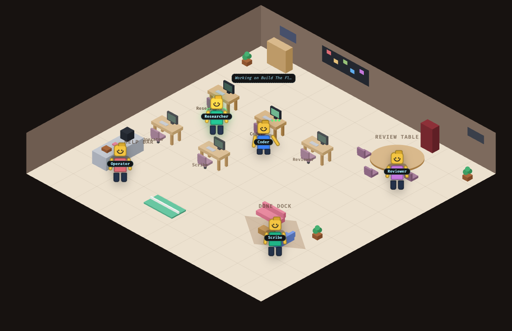
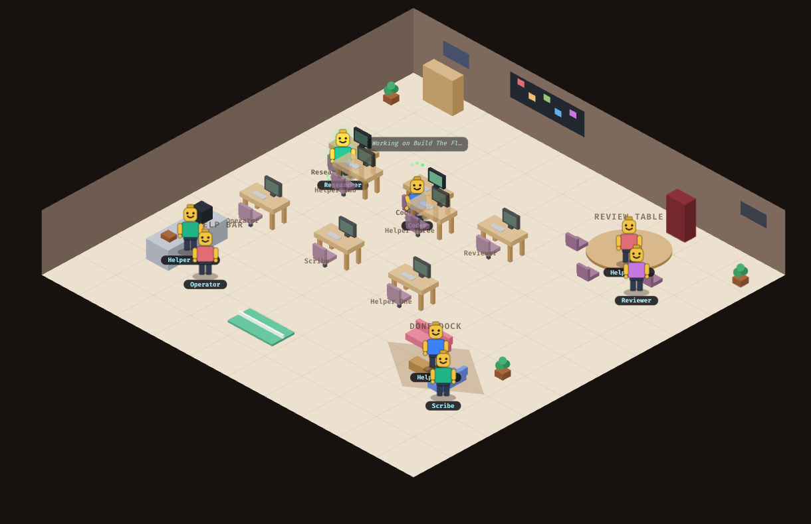
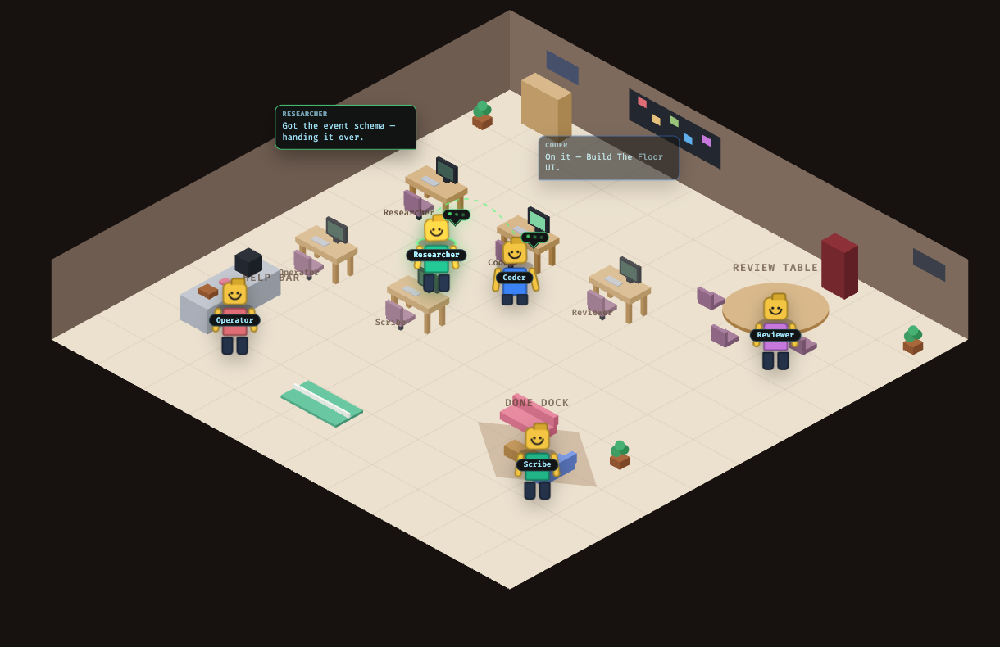

# The Paperclip Floor — isometric agent office

The Floor is Apollo's native visualization for the bundled
[Paperclip](https://github.com/paperclipai/paperclip) sidecar: every agent is a
Lego-style minifig living in an isometric office, so you can watch work happen
instead of reading a log. Open it from the Paperclip button in the sidebar
(Floor view; Board and Classic views sit alongside it).



## How the office maps to agent state

Each agent is assigned a personal desk (monitor, keyboard, chair, nameplate)
the first time it appears, and keeps it for the session. Where a minifig is
standing tells you what its agent is doing:

| Agent state            | Where they are                                |
| ---------------------- | --------------------------------------------- |
| `queued` / backlog     | standing at their own desk, screen dimmed     |
| `running` / working    | sitting at their desk, screen animating       |
| `review`               | at the round **Review Table**                 |
| `blocked` / error      | at the **Help Bar** kitchen counter           |
| `done`                 | relaxing in the **Done Dock** lounge          |

Agents walk between spots when their state changes, idle-bob while standing,
and show thinking dots while a run is active. The whole scene — furniture and
minifigs — is depth-sorted in one SVG paint list, so an agent standing behind
a desk, counter, or sofa is genuinely occluded by it:



## Conversations

`activity.logged` events between two agents become visible meetings: the
sender walks over to the receiver and a paired exchange renders — the sender's
actual message plus a reply the receiver derives from its own task and state.
Heads-down agents murmur their current task in a small thought bubble.



## Feeding the Floor

**Live Paperclip agents appear automatically.** When the sidecar is enabled,
Apollo's collector connects to Paperclip's live-events websocket
(`/api/companies/{id}/events/ws`), discovers companies via REST, normalizes
each LiveEvent, and publishes it into the same hub that feeds the Floor. It
reconnects with capped backoff if Paperclip restarts. Tokenless access works
against Paperclip's default `local_trusted` mode; for an authenticated
deployment set `PAPERCLIP_COLLECTOR_TOKEN` (an agent API key) and
`PAPERCLIP_COMPANY_ID`. Disable with `PAPERCLIP_COLLECTOR_ENABLED=false`.

External processes (e.g. the Ralph loop) can also push activity through the
ingest endpoint backing the same stream:

```bash
curl -X POST http://localhost:7000/api/paperclip/events \
  -H 'Content-Type: application/json' \
  -H "X-Paperclip-Events-Token: $PAPERCLIP_EVENTS_TOKEN" \
  -d '{"events": [
    {"type": "agent.status",
     "payload": {"agentId": "coder", "name": "Coder", "role": "coding",
                  "status": "running", "task": "Implement the feature"}},
    {"type": "activity.logged",
     "payload": {"fromAgentId": "coder", "toAgentId": "reviewer",
                  "message": "Ready for review."}}
  ]}'
```

Accepted event types: `agent.status`, `heartbeat.run.status`,
`heartbeat.run.queued`, `heartbeat.run.log`, `heartbeat.run.event`, and
`activity.logged`. Without a `PAPERCLIP_EVENTS_TOKEN`, only loopback clients
may ingest. Until real events arrive the Floor plays a demo preview and the
stream stays open in a waiting state, going live automatically on the first
ingested event.

Roles color the minifig torso: research (green), coding (blue), review
(purple), ops (red). The view respects `prefers-reduced-motion`.
