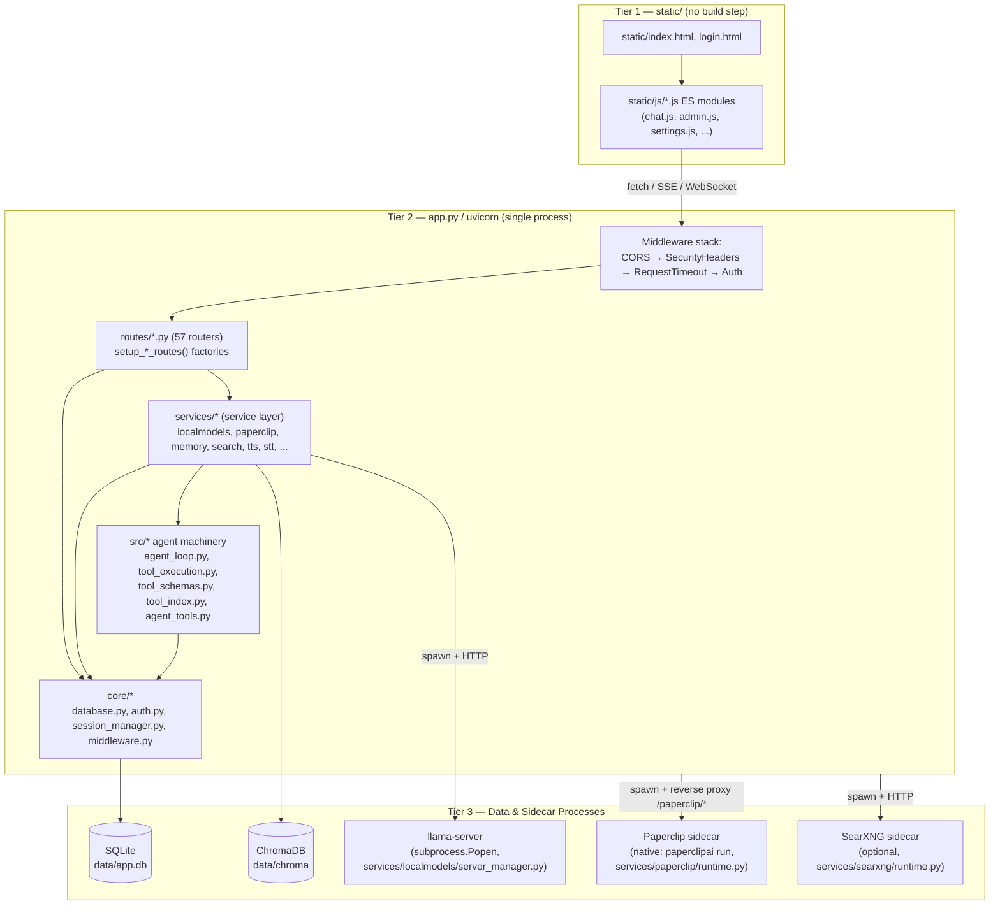

# 01 — Project Overview & Architecture

Verified against the repository at commit-state on disk (this worktree). Every
claim below was checked against source; code snippets are copied verbatim
with file path + line numbers. Line numbers are approximate (±a few lines)
where the file may have shifted since the read, but the quoted text is exact.

## 1. Purpose

Apollo is a **self-hosted, local-first AI workspace** — a single FastAPI
application that bundles a chat/agent interface, memory (mem0-style + a
vector store), deep research, document/canvas editing, email, calendar
(CalDAV), an image gallery/editor, a podcast-free "Cookbook" for downloading
and serving local GGUF models via `llama.cpp`, voice (STT/TTS), a browser
automation tool, MCP client support, scheduled tasks, and a bundled
"Paperclip" multi-agent management sidecar. Its explicit design goal (see
`app.py`, `README.md`) is to run entirely on the user's own machine — no
required cloud services, no Docker requirement on macOS (Docker there has no
Metal GPU access), and a loopback-first security posture for the desktop
case.

Two supported deployment shapes:

1. **Docker Compose** (`docker-compose.yml`) — recommended for servers/NAS.
2. **Native process** — `python -m uvicorn app:app` directly, or via one of
   the OS-specific launch scripts (`start-macos.sh`, `launch-windows.ps1`),
   or as a packaged desktop app (`build-macos-app.sh` /
   `build-macos-bundle.sh` + PyInstaller, `packaging/apollo.spec`).

## 2. Tech Stack (exact pinned versions)

Source of truth: `requirements.txt` (auto-generated by `pip-compile` from
`requirements.in`, "by the following command: pip-compile --output-file=requirements.txt --strip-extras requirements.in", built with **Python 3.12**
per its own header comment). Versions below are copied verbatim from
`requirements.txt`.

### Core web/runtime

| Package | Version | Role in Apollo |
|---|---|---|
| `fastapi` | 0.139.2 | The web framework — `app = FastAPI(...)` in `app.py:80`, all 57 `routes/*.py` routers. |
| `uvicorn` | 0.51.0 | ASGI server process; entry point `python -m uvicorn app:app`. |
| `uvloop` | 0.22.1 (`sys_platform != "win32"` only) | uvicorn's event-loop accelerator; excluded on Windows because upstream doesn't support it (comment in `requirements.in`). |
| `starlette` | 1.3.1 | FastAPI's ASGI toolkit — `BaseHTTPMiddleware`, `StaticFiles`, `RedirectResponse` used directly in `app.py`. |
| `python-multipart` | 0.0.32 | Multipart form parsing for file uploads (`routes/upload_routes.py`). |
| `python-dotenv` | 1.2.2 | `.env` loading — `load_dotenv(encoding="utf-8-sig")` in `app.py:36`. |
| `pydantic` | 2.13.4 | Request/response models across ~30 route/service files (`pydantic.BaseModel`). |
| `pydantic-settings` | 2.14.2 | `src/config.py` settings object. |
| `httpx` | 0.28.1 | All outbound HTTP incl. streaming LLM calls, MCP transport, Paperclip proxy health checks — 37 files import it directly. |
| `websockets` | 16.1.1 | Paperclip sidecar proxy WS bridging (`routes/paperclip_routes.py`), event collector (`services/paperclip/collector.py`). |

### Data layer

| Package | Version | Role |
|---|---|---|
| `sqlalchemy` | 2.0.51 | ORM over SQLite — `core/database.py` (`SessionLocal`, `ApiToken`, `Session`, `ChatMessage`, etc.), used in 17 route/service files. |
| `chromadb` | 1.5.9 | Vector store for personal-doc RAG (`src/chroma_client.py`), semantic memory, tool index (`src/tool_index.py`). |
| `fastembed` | 0.8.0 | Local ONNX embedding model backing RAG + memory vectors (`routes/embedding_routes.py`, `src/embeddings.py`). |
| `numpy` | 2.5.1 | Vector math for RAG/tool-index scoring, gallery image ops, TTS. |

### Agents / tools / MCP

| Package | Version | Role |
|---|---|---|
| `mcp` | 1.28.1 | Model Context Protocol client + the bundled MCP servers under `mcp_servers/` (`memory_server.py`, `rag_server.py`, `image_gen_server.py`, `email_server.py`); `src/mcp_manager.py`. |
| `openai` | 2.46.0 | Pulled in transitively by `unclecode-litellm` (crawl4ai's LLM extraction backend) — Apollo's own LLM calls go through its own `httpx`-based client code, not this SDK directly (no direct top-level import found in `routes/`, `services/`, `src/`, `core/`). |
| `crawl4ai` | 0.9.2 | Web-crawling/extraction backend for the browser & deep-research tools — `services/research/crawl4ai_adapter.py`. |
| `playwright` | 1.61.0 | Headless-browser engine crawl4ai and Apollo's own embedded browser drive — `services/browser/embedded_browser.py`. |
| `patchright` | 1.61.2 | Stealth-patched Playwright fork, a crawl4ai dependency (not directly imported by Apollo code). |
| `playwright-stealth` | 2.0.3 | Anti-bot-detection layer for crawl4ai. |

### Documents, calendar, auth, misc direct deps (from `requirements.in`)

| Package | Version | Role (grep-verified) |
|---|---|---|
| `pypdf` | 6.14.2 | PDF text extraction — `src/personal_docs.py`, `src/document_processor.py`. |
| `beautifulsoup4` (`bs4`) | 4.15.0 | HTML parsing — `services/search/content.py`, `services/search/providers.py`, `src/visual_report.py`, `src/email_thread_parser.py`. |
| `markdown` | 3.10.2 | Markdown→HTML rendering — `src/visual_report.py`. |
| `icalendar` | 7.2.0 | iCalendar parsing/writing — `routes/calendar_routes.py`, `src/caldav_sync.py`, `src/caldav_writeback.py`. |
| `python-dateutil` | 2.9.0.post0 | Date parsing — `routes/calendar_routes.py`. |
| `caldav` | 3.2.1 | CalDAV client protocol — `src/caldav_sync.py`, `src/caldav_writeback.py`. |
| `cryptography` | 49.0.0 | Encryption for stored secrets — `src/api_key_manager.py`, `src/webhook_manager.py`, `src/secret_storage.py`. |
| `bcrypt` | 5.0.0 | Password/API-token hashing — `app.py` (token cache `_bcrypt.checkpw`), `routes/api_token_routes.py`, `core/auth.py`, `companion/pairing.py`. |
| `pyotp` | 2.10.0 | TOTP 2FA — `core/auth.py`. |
| `qrcode` | 8.2 (`[pil]` extra) | QR code generation — `companion/pairing.py` (device-pairing QR). |
| `croniter` | 6.2.4 | Cron-expression scheduling for tasks — `routes/task_routes.py`, `src/task_scheduler.py`. |
| `python-magic` | 0.4.27 | File-type sniffing on upload — `src/upload_handler.py`. |
| `charset-normalizer` | 3.4.9 | Encoding detection — `routes/memory_routes.py`, `src/document_processor.py`. |
| `requests` | 2.33.1 (pinned `<2.34`, see comment below) | Synchronous HTTP — `routes/email_pollers.py`, `routes/email_routes.py`, `routes/chat_helpers.py`. Pin note in `requirements.in`: *"CalDAV pulls urllib3-future through niquests. requests 2.34 assumes the standard urllib3 module layout and fails when that package is installed."* |

### Optional (`requirements-optional.txt`) — lazy-imported, absence handled gracefully

| Package | Purpose | Notes from source comments |
|---|---|---|
| `faster-whisper` | Local STT ("local" provider) | CPU by default (CTranslate2), GPU auto-detected if `torch` present. |
| `piper-tts` | Local TTS (Piper ONNX voices) | CPU-only, Mac/Metal-friendly (Kokoro needs CUDA). |
| `duckduckgo-search` | DDG search provider option | Alternative to SearXNG/Brave/Tavily/Serper/Google PSE. |
| `PyMuPDF` | PDF form-filling (AcroForm) | **AGPL-3.0** — deliberately kept out of the default install; MIT core (`pypdf`) covers text extraction without it. |
| `markitdown[docx,pptx,xlsx,xls]` | ==0.1.5 | Office/EPUB → Markdown conversion for chat attachments + RAG. Pinned "to a release >30 days old per the dependency-age discussion in issue #485" (comment in `requirements-optional.txt`). |

### Dev/test-only (`requirements-dev.txt`, generated from `requirements-dev.in`)

| Package | Version |
|---|---|
| `pytest` | 9.1.1 |
| `pytest-asyncio` | 1.4.0 |
| `httpx2` | 2.7.0 |
| `pip-tools` | 7.6.0 |
| `pip-audit` | 2.10.1 |
| `ruff` | 0.15.22 |

Full transitive dependency list (136 more packages — grpc/OpenTelemetry
stack for `chromadb`, `kubernetes` client for `chromadb`'s optional
distributed mode, `nltk`/`rank-bm25`/`shapely`/`trimesh`/`alphashape`/`rtree`
for `crawl4ai`'s content-extraction pipeline, `unclecode-litellm` +
`tiktoken` for crawl4ai's LLM-extraction strategy, etc.) is enumerated with
full pins in `docs/recreate/02-environment-setup-dependencies.md` — none of
those 136 are imported directly by Apollo's own `app.py`/`routes/`/`services/`/`src/`/`core/`
code (grep-verified); they are pulled in solely to satisfy `chromadb`,
`crawl4ai`, `mcp`, or `caldav`.

## 3. Three-Tier Architecture

```
┌─────────────────────────────────────────────────────────────┐
│  TIER 1 — Frontend (static/, no build step)                  │
│  Vanilla JS ES modules served as-is by StaticFiles            │
│  static/index.html + static/js/*.js (81 top-level modules)   │
└───────────────────────────┬────────────────────────────────┘
                             │ fetch()/SSE/WebSocket over HTTP(S)
┌───────────────────────────▼────────────────────────────────┐
│  TIER 2 — Backend (single uvicorn process, app.py)            │
│  FastAPI app · CORS/Security/Timeout/Auth middleware stack    │
│  57 routers (routes/*.py) → services/* → core/* + src/*      │
│  In-process: SQLAlchemy engine, agent loop, task scheduler,   │
│  MCP client manager, webhook manager, event bus               │
└──────┬───────────────┬────────────────┬──────────────────────┘
       │                │                │
┌──────▼─────┐   ┌──────▼──────┐  ┌──────▼─────────────────────┐
│ TIER 3a     │   │ TIER 3b     │  │ TIER 3c                    │
│ SQLite      │   │ ChromaDB    │  │ Subprocess sidecars:        │
│ (app.db,    │   │ (embedded,  │  │ - llama-server (GGUF models)│
│ core/       │   │ persistent  │  │ - Paperclip (native mode)   │
│ database.py)│   │ client,     │  │ - SearXNG (optional)        │
│             │   │ data/chroma)│  │                              │
└─────────────┘   └─────────────┘  └──────────────────────────────┘
```

### Component relationship diagram



## 4. Architectural Patterns

### 4.1 Router-per-domain (`routes/`)

Every domain has one `routes/<domain>_routes.py` file exporting a
`setup_<domain>_routes(...)` **factory function** that returns an
`APIRouter`. `app.py` never defines route logic inline (aside from a
handful of always-on endpoints — `/`, `/api/health`, `/api/version`, static
serving). Example from `app.py:625`:

```python
# Documents (artifacts/canvas)
from routes.document_routes import setup_document_routes
build_and_include_router(app, "Documents", setup_document_routes, session_manager, upload_handler, logger=logger)
```

58 files live in `routes/` (57 `*_routes.py` router modules + a small
number of `*_helpers.py`/`*_pollers.py`/`*_runner_files.py` support modules
that are not routers themselves — `chat_helpers.py`, `cookbook_helpers.py`,
`cookbook_runner_files.py`, `document_helpers.py`, `email_helpers.py`,
`email_pollers.py`, `gallery_helpers.py`).

Registration is centralized through `services/app_startup.py`
(`RouterSpec`, `build_and_include_router`, `include_router_checked`,
`register_router_specs` — full source, 66 lines):

```python
# services/app_startup.py:10-46
@dataclass(frozen=True)
class RouterSpec:
    label: str
    factory: Callable[..., Any]
    args: tuple[Any, ...] = ()
    kwargs: dict[str, Any] = field(default_factory=dict)

def include_router_checked(app, router, label, logger=None):
    try:
        app.include_router(router)
    except Exception as exc:
        if logger: logger.exception("Failed to register %s routes", label)
        raise RuntimeError(f"Failed to register {label} routes") from exc
    ...

def build_and_include_router(app, label, factory, *args, logger=None, **kwargs):
    try:
        router = factory(*args, **kwargs)
    except Exception as exc:
        if logger: logger.exception("Failed to build %s routes", label)
        raise RuntimeError(f"Failed to build {label} routes") from exc
    return include_router_checked(app, router, label, logger=logger)
```

`app.py` uses two idioms: single-router calls via `build_and_include_router(app, label, factory, ...)`
directly, and batches via `register_router_specs(app, [RouterSpec(...), ...])` (see `app.py:587-614`
and `app.py:712-720`) — the batched form is used where several routers share
constructor dependencies (e.g. all of `Emoji`, `Activity`, `ModelHub`,
`Sessions`, `Admin wipe`, `Memory`, `Skills`, `SkillPacks`, `Chat`,
`Research`, `History`, `Search`, `Presets`, `Diagnostics`, `Cleanup`,
`Personal docs`, `Embedding`, `Models`, `TTS` are registered as one list).
Every registration failure raises immediately at startup with a labeled
`RuntimeError` — there is no silent partial-boot.

### 4.2 Service layer (`services/`)

`services/` holds business logic that is either (a) shared across multiple
routers, (b) manages external subprocess/sidecar lifecycles, or (c) is
heavy enough to deserve its own module tree. 29 top-level entries, several
of which are themselves packages: `browser/`, `docs/`, `faces/`, `hwfit/`,
`integrations/`, `localmodels/`, `memory/`, `paperclip/`, `research/`,
`review/`, `search/`, `searxng/`, `shell/`, `skills/`, `stt/`, `tts/`,
`youtube/`. Routers call into `services/*` rather than embedding business
logic directly — e.g. `routes/localmodels_routes.py` delegates process
management to `services/localmodels/server_manager.py`.

### 4.3 `src/` agent machinery

`src/` (88 files) is the largest tier and holds everything that isn't a
route or a service: the LLM chat/agent loop, tool parsing/execution/schema
registries, memory, RAG, auth helpers, task scheduling, MCP management, and
core app wiring (`app_initializer.py`, `app_helpers.py`, `constants.py`).
The agent-tool subsystem specifically is layered:

- `src/tool_schemas.py` — OpenAI-compatible function-calling JSON schemas (`FUNCTION_TOOL_SCHEMAS`).
- `src/agent_loop.py` (2331 lines) — the conversation loop, `TOOL_SECTIONS` (per-tool prompt text), `AGENT_SYSTEM_PROMPT` assembly.
- `src/agent_tools.py` — facade re-exporting `tool_parsing.py`, `tool_schemas.py`, `tool_execution.py`, `tool_implementations.py`; also owns `TOOL_TAGS` (which fenced-code-block tags the parser recognizes) and `MAX_AGENT_ROUNDS`/timeouts.
- `src/tool_index.py` (499 lines) — RAG-based tool *selection*: embeds `BUILTIN_TOOL_DESCRIPTIONS` into a ChromaDB collection (`apollo_tool_index`) and retrieves only the top-K relevant tools per message instead of injecting all of them into every prompt.
- `src/tools/` — a further-split package (`admin.py`, `chats.py`, `cookbook.py`, `documents.py`, `media.py`, `notes_calendar.py`, `research_contacts.py`, `skills_tasks.py`, `vault.py`, `web.py`, `_common.py`, `_state.py`) holding the actual `do_*` tool implementations grouped by domain.

See `docs/recreate/15-file-structure-code-organization.md` §5 for the full
four-registry contract that adding a new tool must satisfy.

### 4.4 Single-process design

Everything — HTTP handling, the agent loop, the task scheduler, the MCP
client, the webhook manager, background asyncio tasks (tool-index warmup,
endpoint keepalive, nightly skill audit, idle-kernel reaping) — runs inside
**one** `uvicorn` process (`python -m uvicorn app:app`). There is no
separate worker/queue process; long-running work either streams via SSE
(`/api/chat`, `/api/shell/stream`) or is exempted from the 45s hard request
timeout (see §6). The only things that run as *separate OS processes* are
the llama-server subprocess(es), the optional Paperclip Node sidecar, and
the optional SearXNG sidecar — all supervised (spawned/health-checked/
killed) by code inside this same uvicorn process.

### 4.5 Loopback-only desktop mode

`app.py:264-278` defines `_is_trusted_loopback(request)`: true only for a
**direct** connection from `127.0.0.1`/`::1` carrying none of the
proxy-forwarding headers (`cf-connecting-ip`, `cf-ray`, `cf-visitor`,
`x-forwarded-for`, `x-forwarded-host`, `x-real-ip`, `forwarded`) — this
prevents a Cloudflare-tunneled or reverse-proxied remote request from
inheriting local trust. Two features build on this:

- `LOCALHOST_BYPASS=true` (`app.py:156-178, 316-324`) — skips login entirely
  for trusted-loopback callers, attributing their requests to an admin user
  (or the first user, or anonymous) via `_bypass_user()`.
- The **internal-tool token bypass** (`app.py:285-311`) — the agent's own
  loopback HTTP calls into admin-gated routes carry
  `X-Apollo-Internal-Token` + optional `X-Apollo-Owner` (impersonation),
  checked with `secrets.compare_digest` against `INTERNAL_TOOL_TOKEN` from
  `core/middleware.py`, and only accepted from a trusted-loopback client.

## 5. Startup Sequence (from `app.py`, in exact source order)

1. **Module-level side effects before any FastAPI object exists**
   (`app.py:1-36`): `register_static_mime_types()` forces `text/javascript`
   / `application/javascript` MIME mappings (works around stale Windows
   registry mappings breaking ES-module `<script type="module">` loads).
   On `os.name == "nt"`, sets `HF_HUB_DISABLE_SYMLINKS`/`_WARNING` env vars
   *before* any HuggingFace import (network-share/UNC data dirs can't
   follow HF's symlinks — `[WinError 1463]`). Then `load_dotenv(encoding="utf-8-sig")`
   — the BOM-tolerant encoding is explicitly to avoid issue #142 (a
   Notepad-saved `.env` with a BOM silently breaking `AUTH_ENABLED=false`).
2. **`FastAPI()` instantiation** (`app.py:80-84`) — title "AI Chat
   Application", `version="1.0.0"`.
3. **Middleware, added in this order** (Starlette executes them in
   reverse-add order, i.e. last-added runs first around the handler):
   `CORSMiddleware` → `SecurityHeadersMiddleware` (`core/middleware.py`) →
   `_RequestTimeoutMiddleware` (45s default, `REQUEST_HARD_TIMEOUT` env,
   exempts 9 path prefixes including `/api/chat`, `/api/shell/stream`,
   `/api/research`) → `AuthMiddleware` (only added if `AUTH_ENABLED` is not
   `"false"`).
4. **Auth setup** (`app.py:151-405`) — `AuthManager()` instance on
   `app.state.auth_manager`; if `AUTH_ENABLED`, builds the exempt-path sets
   (`AUTH_EXEMPT_EXACT`, `AUTH_EXEMPT_PREFIXES` = `["/static", "/lmproxy"]`,
   `AUTH_EXEMPT_PATTERNS` = webhook-token URLs), an in-memory API-token
   cache (`_token_cache`, refreshed lazily on a dirty flag rather than
   per-request), then defines and installs `AuthMiddleware`.
5. **Static file mount** (`app.py:408-427`) — `_RevalidatingStatic` (a
   `StaticFiles` subclass) mounted at `/static`; forces
   `Cache-Control: no-cache` on `.js`/`.css`/`.html` so the no-build-step
   frontend never serves stale cached modules.
6. **`/api/generated-image/{filename}`** route defined inline (ownership
   check against `GalleryImage` rows, immutable long-cache for content-hash
   filenames).
7. **YouTube init** — `services.youtube.init_youtube()`.
8. **RAG init** — `get_rag_manager()` (lazy; returns `None` if ChromaDB
   isn't reachable, personal-doc routes then 503 cleanly instead of retry-
   looping).
9. **Config import** — `from src.config import config`.
10. **Component initialization** — `components = initialize_managers(BASE_DIR, rag_manager)`
    (`src/app_initializer.py`) builds `session_manager`, `memory_manager`,
    `memory_vector`, `upload_handler`, `personal_docs_manager`,
    `api_key_manager`, `preset_manager`, `chat_processor`,
    `research_handler`, `chat_handler`, `model_discovery`,
    `skills_manager` — unpacked into local names at `app.py:510-523`.
11. **TTS service** — `get_tts_service()`.
12. **Exception handlers** registered for `SessionNotFoundError`,
    `InvalidFileUploadError`, `LLMServiceError`, `WebSearchError`.
13. **Webhook manager** — `WebhookManager(api_key_manager=api_key_manager)`.
14. **~50 routers included**, in this rough grouping/order: Auth → Uploads
    → (Emoji, Activity, ModelHub, Sessions, Admin wipe, Memory, Skills,
    SkillPacks, Chat, Research, History, Search, Presets, Diagnostics,
    Cleanup, Personal docs, Embedding, Models, TTS as one `register_router_specs`
    batch) → STT → Documents → Signatures → Gallery → Editor drafts →
    Tasks (+ `TaskScheduler` construction and `set_task_scheduler`) →
    Assistants → Calendar → Shell → Cookbook → Hardware fit → Local models
    → Compare → Preferences → Backup → Fonts → MCP (`McpManager()` +
    `set_mcp_manager`) → AI interaction tools wiring → (Webhooks, API
    tokens, Notes, Email, Vault, Contacts, Companion as one batch) →
    Paperclip sidecar proxy (+ `EventHub`, `AgentTokenRegistry`,
    `PaperclipCollector`) → Integration status → System status → Browser →
    Local-model OpenAI proxy (`lmproxy_routes`).
15. **Native Paperclip lifecycle wiring** — `PaperclipRuntime` instance
    stored on `app.state.paperclip_runtime`; started from an
    `@app.on_event("startup")` handler (see §6).
16. **Local-model directory scan** kicked off on a background thread
    (`services.localmodels.lifecycle.startup_scan`), non-blocking.
17. **SearXNG sidecar** — `@app.on_event("startup")`/`"shutdown")` pair
    starting/stopping `services.searxng.runtime.get_runtime()` on a thread;
    skipped entirely if SearXNG isn't installed (falls back to DuckDuckGo).
18. **SPA routes** — `/`, `/notes`, `/calendar`, `/cookbook`, `/email`,
    `/memory`, `/gallery`, `/tasks`, `/library` all call `serve_index()`,
    which serves `static/index.html` with a CSP nonce injected via
    `_serve_html_with_nonce()`; `/backgrounds` and `/login` serve their own
    HTML directly (no-auth sandbox page and the login page respectively).
19. **`/api/version`, `/api/health`, `/api/ready`, `/api/runtime`** —
    liveness vs. readiness split: `/api/health` is unconditional 200;
    `/api/ready` calls `src.readiness.check_readiness()` and returns 503
    unless every critical subsystem (DB, data dir, local-first storage) is
    whole.
20. **`@app.on_event("startup") async def startup_event()`**
    (`app.py:1044-1284`) — the main lifecycle hook, in order:
    - `webhook_manager.set_loop(...)`.
    - Purges leftover `"Nobody"`/`"Incognito"` sessions from a previous
      process (incognito sessions are ephemeral by design).
    - Keeps strong references to fire-and-forget tasks in
      `app.state._startup_tasks` (explicit comment: "Without this, Python
      may GC tasks created with `asyncio.create_task(...)` before they
      finish").
    - Starts `upload_cleanup_task` if the upload router returned a cleanup
      coroutine.
    - Starts the background-job monitor (`src.bg_monitor.start_bg_monitor`)
      — auto-continues the agent when a `#!bg` bash job finishes.
    - Schedules `_startup_mcp_connections()` (registers built-in MCP
      servers, then `mcp_manager.connect_all_enabled()` with a 20s
      timeout) — deliberately *after* the server starts accepting traffic.
    - Schedules `_warmup_tool_index()` — pre-warms the embedding model +
      ChromaDB tool index off the first user request (comment: "otherwise
      lands on the user's FIRST message ... a big `tool_selection` time").
    - Schedules `_warmup_endpoints()` (pings up to 5 known LLM endpoints)
      and a `_keepalive_loop()` that repeats it every 60s.
    - `await _ensure_default_tasks()` — reconciles/creates default
      automation tasks + a personal assistant for every user found in
      `data/auth.json`, and separately reconciles owners already present in
      `ScheduledTask` rows (cleans up stale/demo/deleted-user built-ins).
    - Backfills ownerless/legacy skill `SKILL.md` files to the primary
      admin owner (`skills_manager.backfill_owner`).
    - `await task_scheduler.start()` **unless**
      `APOLLO_INPROCESS_TASKS` is falsy (`"0"/"false"/"no"/"off"`), mirroring
      the same env-var pattern used for email pollers — lets an external
      cron drive task firing instead.
    - Schedules an hourly `_null_owner_sweep_loop()` (re-runs
      `core.database._migrate_assign_legacy_owner`) and a 10-minute
      `_python_session_reaper_loop()` (reaps idle `python_session` kernels).
    - Schedules `_skill_audit_nightly_loop()` — sleeps until a configurable
      local hour (`skill_audit_hour`, default 2 AM), then runs
      `routes.skills_routes.run_scheduled_skill_audit` on a rotating batch
      (`skill_audit_batch`, default 8) if `skill_audit_nightly` is enabled.
21. **`@app.on_event("shutdown") async def shutdown_event()`**
    (`app.py:1286-1322`) — cancels `upload_cleanup_task`, stops
    `task_scheduler`, closes `webhook_manager`, disconnects all MCP
    servers, calls `services.localmodels.server_manager.get_server().stop_all()`
    ("Stop any local llama-server processes so they don't outlive the
    app"), and stops all `python_session` kernels.
22. Two more `@app.on_event` pairs registered earlier but logically part of
    startup/shutdown: `_start_paperclip_runtime`/`_stop_paperclip_runtime`
    (§6) and `_start_searxng_runtime`/`_stop_searxng_runtime`.

## 6. Process Model

Apollo is **one uvicorn process** that supervises up to three categories of
child OS processes:

### 6.1 The uvicorn process itself

```
python -m uvicorn app:app --host 127.0.0.1 --port 7000
```
(`app:app` = the `FastAPI()` instance in `app.py`; default port 7000, or
7860 on the macOS quick-start script because "macOS AirPlay Receiver often
holds 7000" — `start-macos.sh` comment.)

### 6.2 llama-server (local GGUF model serving)

`services/localmodels/server_manager.py` (docstring: *"Launch and track
local llama-server processes (single warm chat model)"*) spawns
`llama-server` via `subprocess.Popen`:

```python
# services/localmodels/server_manager.py:228-230
logger.info("Starting llama-server: %s", " ".join(cmd))
...
proc = subprocess.Popen(cmd, stdout=logf, stderr=subprocess.STDOUT, text=True)
```

Binary discovery order (same file): an explicit configured path (Settings →
AI → Local Models → llama-server Binary, or `APOLLO_LLAMA_SERVER` env var)
wins; otherwise PATH lookup plus a platform-specific candidate list — on
Windows: scoop shims, `%LOCALAPPDATA%\llama.cpp`, `%ProgramFiles%\llama.cpp`,
`~\llama.cpp\build\bin\Release\llama-server.exe`; on POSIX:
`~/.local/bin`, `~/bin`, `~/llama.cpp/build/bin`, `/opt/homebrew/bin`,
`/usr/local/bin`. The manager waits on a health probe
(`_wait_health`, raises `TimeoutError` if the server doesn't come up) and
`app.py`'s shutdown hook calls `get_server().stop_all()` so no orphaned
`llama-server` process survives the parent exiting.

### 6.3 Paperclip sidecar (native mode)

When `PAPERCLIP_MODE=native` and `PAPERCLIP_ENABLED=true` (both are the
Windows-launcher defaults — `launch-windows.ps1:199-200`), Apollo:

1. Auto-provisions a pinned Node runtime into `~/.apollo/.node`
   (`services/paperclip/node_bootstrap.py::ensure_node`) — "so a fresh
   Mac/Windows install needs no Node prerequisite. Falls back to a system
   Node if the download fails" — unless an already-serving Paperclip
   instance is detected (`_paperclip_runtime._already_serving()`), in which
   case the Node download is skipped entirely.
2. Starts it via `PaperclipRuntime.start()` (`services/paperclip/runtime.py`)
   and waits up to 90s for health (`wait_healthy(timeout=90)`), on a
   **daemon thread**, not blocking app startup (`app.py:869-896`).
3. Reverse-proxies `/paperclip/*` HTTP through `AuthMiddleware`; the
   WebSocket path bypasses that middleware, so the WS handler validates the
   session cookie itself via `auth_manager` (comment in `app.py:723-725`).
4. Points Paperclip's own agents at Apollo's **local-model OpenAI proxy**
   (`routes/lmproxy_routes.py`, mounted at `/lmproxy`, exempted from
   `AuthMiddleware` because it has its own bearer-token check) — the proxy
   forwards to whichever GGUF model Apollo currently has warm
   (`_warm_chat_base_url()` inspects `get_server().status()` for a running
   `kind == "chat"` slot).
5. Shutdown stops the collector then the runtime
   (`_stop_paperclip_runtime`, `app.py:902-905`).

### 6.4 SearXNG sidecar (optional)

`services/searxng/runtime.py::get_runtime()` — started/stopped on daemon
threads from `@app.on_event` hooks; "start if installed+enabled; reuse an
already-running instance. Skipped entirely when not installed — search then
falls back to DuckDuckGo via the provider chain" (`app.py:913-915` comment).
No Docker involved — this is a managed native sidecar like Paperclip and
llama-server, not a container.

### 6.5 Summary table

| Process | Spawned by | Lifecycle | Health/stop |
|---|---|---|---|
| uvicorn (Apollo itself) | user/launch script | foreground, one process for the app's whole life | Ctrl+C / OS signal |
| `llama-server` | `services/localmodels/server_manager.py` via `subprocess.Popen` | on-demand when a local GGUF model is selected | health-polled on start; `stop_all()` on Apollo shutdown |
| Paperclip (`paperclipai run`) | `services/paperclip/runtime.py` (native mode only) | started async on Apollo startup, 90s health wait | `wait_healthy`; stopped on Apollo shutdown |
| SearXNG | `services/searxng/runtime.py` (if installed) | started async on Apollo startup | reuses existing instance if already running; stopped on Apollo shutdown |

UNCERTAIN: The exact `llama-server` CLI flags (context size, GPU layers,
etc.) are computed dynamically per-model in `server_manager.py` and were
not fully enumerated here — see that file directly for the current flag
set, as it is one of the more actively-tuned parts of the codebase.
